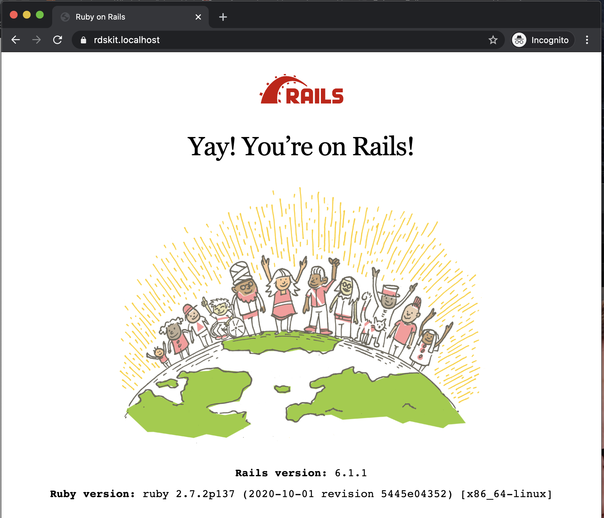

# Rails Docker Starter Kit


Here is a Rails-Docker starter kit, that would allow you to get your app up and running in 3 steps.

__What's in the box?__
- Rails 6
- Docker
- Postgres
- Traefik basic setup to run https locally

## Prerequisites
Make sure you have the following installed
- `Docker` - check out https://docs.docker.com/get-docker/ for details
- `docker-compose` cli - check out https://docs.docker.com/compose/install/ for installation details

As of now I am running `docker desktop` v3.0.4 on my mac and `docker-compose` cli v1.27.4

## Install & Run
Here is a starter kit for Rails 6.  Setup is simply 2 steps.

1. Install and run starter kit by running ...
    ```shell
    git clone https://github.com/joshtune/rails-docker-starter-kit.git
    cd rails-docker-starter-kit && chmod +x init.sh && ./init.sh
    ```

2. Open app in your browser at `https://rdskit.localhost/`
   
   
## Usage
After installation, you now have a fresh rails app, ready for development.

You should have full access to `rails` cli. Check it out ...

### Get Rails Version
```
# input
docker-compose run --rm app rails -v

# output
Creating rails-docker-starter-kit_app_run ... done
Rails 6.1.1
```

### Get Rails CLI Help
input
```
# input
docker-compose run --rm app rails -v

# output
Creating rails-docker-starter-kit_app_run ... done
The most common rails commands are:
 generate     Generate new code (short-cut alias: "g")
 console      Start the Rails console (short-cut alias: "c")
 server       Start the Rails server (short-cut alias: "s")
 test         Run tests except system tests (short-cut alias: "t")
 test:system  Run system tests
 dbconsole    Start a console for the database specified in config/database.yml
              (short-cut alias: "db")

 new          Create a new Rails application. "rails new my_app" creates a
              new application called MyApp in "./my_app"           
 ...
```


